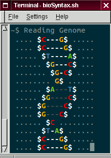

	"HAPPINESS ONLY REAL WHEN SHARED" -C. McCandless

bioSyntax is a community project for scientific syntax highlighting. We encourage you to change and customize it to suit your needs. This page is a collection of resources to help you start that journey. Once you create something helpful, chances are others will find it helpful too, so share :)

{:toc}

1. [Development Guidelines](#biosyntax-development-guidelines)
...

# bioSyntax Development Guidelines

## Design Principles

1. KISS: Keep it simple & sweet.

2. Grok your data.
	Syntax highlighting increases legibility, that is the ease with which characters are read. Great syntax highlighting (in science) also reveals the content of the data with a glance.
	To understand what information is important, you should understand the data structure and how its being applied/used by scientists (opposed to machine parsing). The most valuble asset here is real-life experience working with a file type.

3. Make it portable.
	Scientific computing is messy and often not standardized. The syntax you develop may work for your use-cases but not be widely portable. A few steps from the beginning can help you define syntax broadly and accurately.
	- Find and carefully read the **Format Specification** for you file-type (i.e. [SAM Spec](https://samtools.github.io/hts-specs/SAMv1.pdf)). This is your primary guide for what is and is not appropriate within a file-type.
	- Find multiple example files in the central databases (NCBI SRA, EMBL-EBI, RCSB, ...).
	- Find multiple example files used by large consortiums or teams (ENCODE, 1000 Genomes Project, RefSeq, ...)
	- Find multiple example files output from common software packages (GATK, CLUSTAL, UCSC Genome Browser, Galaxy, ...)

## Developing syntax-highlighting for `<$file-format>`

If you work with a scientific file-format and would like to add syntax-highlighting to it, we'd like to help you develop it.

1. Fork the bioSyntax repository.
2. Search [bioSyntax Issues](LINK) for the file-format you're interested in.
	- If it exists; Help develop it.
	- If it doesn't exist; start an issue for that format.
		a) Title:"FORMAT DEVELOPMENT: `<$file-format>`"
		b) Include a 'File Specification Definition'
		c) Find and include 3-4 example data files (<100 kb) for testing
		d) In words, write out a 'sketch' of how you would like the syntax highlighting to function
3. Read other examples of syntax-definition files to learn how it functions.
4. Develop the syntax definition file for your format.
5. Ideally, once your familiar with the file format and it's definitions you'll be able to quickly port it (**vim**, **less**, **gedit** and **sublime**).
6. Once you're happy with the results and it's working, submit it to the main bioSyntax repository by placing a "pull request". We'll review the code and add it to the next release.

## Porting bioSyntax to `<$software>`

The choice of text-editors we included is based on our own use. To port bioSyntax to another program or interface:

1. Fork the bioSyntax repository.
2. Search [bioSyntax Issues](LINK) for the software port you're interested in.
	- If it exists; Help develop.
	- If it doesn't exist; start an issue for that port.
		a) Title:"PORT: `<$software>`"
		b) Find out and link resources on how syntax-highlighting files are set up for that program
		c) Write syntax definition files for the bioSyntax *core file-types*
3. Once you're happy with the results and it's working, submit it to the main bioSyntax repository by placing a "pull request". We'll review the code and add it to the next release.

## Creating a custom color-theme

If you're particular about how you want everything to look. Feel free to tweak the theme files. If you develop a theme you think is exceptionally good then we'd be happy to see it. Follow the steps for developing a file format and put in a pull request to add it to bioSyntax. 

## Other ways to Collaborate

If you like bioSyntax and would like to help out in other ways, check the [bioSyntax Issues](https://github.com/ababaian/bioSyntax/issues) to see if you can help solve an open problem.  Problems tagged `help` are often a good place to start with.

Looking for a side-project to work on? Take on one of the projects from the [bioSyntax TODO](https://github.com/ababaian/bioSyntax/issues).

# Useful Resources

- [How to use Regular Expression](https://www.ugrad.cs.ubc.ca/%7Ecs121/2011W2/Labs/Lab8/lab8.html)
- [Regex Cheatsheet](http://www.rexegg.com/regex-quickstart.html)
- [Ruby Regex Tester](http://rubular.com/)
- [Optimizing Regex](http://www.rexegg.com/regex-optimizations.html)
- [Selecting columns with Regex](https://github.com/ababaian/bioSyntax/issues/17)

# Syntax Development for `less`

Syntax highlighting in **less** is non-standard. We use the **source-highlight** package to accomplish this. 

### Resources
- [**source-highlight** website](https://www.gnu.org/software/src-highlite/)
- [**source-highlight** syntax Documentation](https://www.gnu.org/software/src-highlite/source-highlight.html#Language-Definitions)
- [8-bit ANSI Escape Code Colors](https://en.wikipedia.org/wiki/ANSI_escape_code#8-bit)

### Development

1. Language Definition files are stored in `$SOURCE_HIGHLIGHT_PATH/<language>.lang`
2. Every `<language>.lang` file has an associated `<language>.style` file which assigns the regex variable in `.lang` to color variables in `.outlang`.
3. The main color-theme files are either; `biosyntax.outlang` or `biosyntax-vcf.outlang`. This is the only place where colors are set.
4. Automatic file-extension recognition for less is performed by the `src-hilite-lesspipe.sh` script.
5. To add pipe-capability in less; `alias` are defined in the users `.bashrc` or `.zshrc`. All bioSyntax aliases can be found in the `$BIOSYNTAX/less/rc_append.txt` file.

- To maximize compatibility; please limit color use to  Xterm 8-bit (256 colors)
- On different systems the `src-hilite-lesspipe.sh` script is installed to a different directories. 
	Ubuntu: `/usr/share/source-highlight/src-hilite-lesspipe.sh`
	CentOS: `/usr/bin/src-hilite-lesspipe.sh`

# Development for `vim`

# Development for `gedit`

# Development for `sublime`

	

